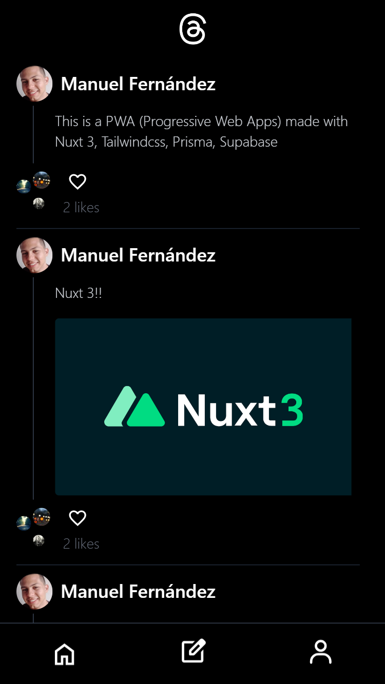

# **PWA Threads Clone / Practice!**

---

### Hi! Welcome to this new project. This is a PWA practice made with:

- Nuxt 3

- Tailwindcss

- Prisma

- Supabase

---

### Some of the functionalities of the application are:

- Login and logout

- Create and delete a post
  - Write a text
  - Upload an picture

- **_Like_** and **_unlike_** a post

---

## Application Images

#### Home View:

---

#### login View:

---

#### New Post View:

---
#### log out View:

---

